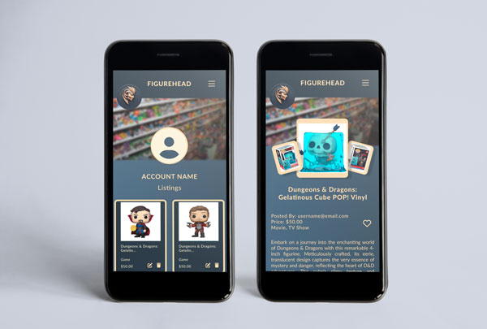

# Summative 3 :desktop_computer:

## FigureHead App :dolls: :performing_arts:


**FigureHead, a dedicated online platform for figurine enthusiasts, faces the challenge of
creating a compelling and user-friendly environment for figurine lovers to connect, trade, and explore their shared passion.**

### The app, FigureHead, offers the following key features:
 
*1. User-Centric Design: Provides an intuitive and visually appealing interface for easy navigation and the discovery of figurines of interest, promoting user engagement.*

*2. Community Building: Fosters community interaction through comment boards, promoting bonding among figurine enthusiasts.*

*3. Mobile App Development: Offers a responsive, feature-rich mobile app for convenient on-the-go access to browsing, buying, and community interaction.*

*4. Listing Management: Allows users to easily add new figurine listings with details such as images, descriptions, and pricing.*

*5. Edit and Delete Listings: Enables users to edit existing listings and remove them when they are no longer relevant.*

*6. Viewing Other Users' Listings: Provides a user-friendly search and filter system for browsing and viewing listings by category.*

*7. User Authentication: Implements secure login and sign-up systems with unique usernames and passwords for a personalized user experience.*


# MOCKUPS





### This project focuses on creating a backend and frontend. 

## Backend of the FigureHead includes the following packages and components :

1. **npm init -y command**

It generates a package.json file for the Node.js project with default values for various fields. 
The package.json file is an essential part of any Node.js project, as it contains metadata about the project and its dependencies. 

2. **npm i express command**

It is used to install the "Express" package in a Node.js project. 
Express is a popular web application framework for Node.js that simplifies the process of building web applications and APIs.
When npm i express is running, it tells npm (Node Package Manager) to download and install the Express package from the npm registry into the project's node_modules directory. Additionally, it updates the  project's package.json file to include Express as a dependency.

3. **npm i dotenv command**

It is used to install the "dotenv" package in a Node.js project. The dotenv package is commonly used to load environment variables from a file named .env into a Node.js application's environment. This is useful for managing configuration settings, API keys, and other sensitive information without hardcoding them directly into your code.

4.  **npm i mongoose command**. 

It is used to install the "mongoose" package in a Node.js project. Mongoose is a popular library for working with [MongoDB](https://www.mongodb.com), a NoSQL database, in Node.js applications. It provides easy-to-use way to interact with MongoDB databases by defining data models, schema, and performing various database operations.

5. **npm i cors command**

It is used to install the "cors" package in a Node.js project. The "cors" package is a middleware for Express.js applications that helps handle Cross-Origin Resource Sharing (CORS) for HTTP requests.
CORS is a security feature implemented in web browsers to prevent web pages from making requests to a different domain than the one that served the web page. This security measure can be restrictive for web applications that need to make requests to APIs on different domains. The "cors" package allows to control and configure CORS settings in the Express.js application, enabling user to specify which origins (domains) are allowed to make requests to their server.

6. **npm i bcrypt command**

It is used to install the "bcrypt" package in a Node.js project. Bcrypt is a popular library for securely hashing passwords. It provides a way to hash passwords before storing them in a database, making it difficult for attackers to recover the original passwords even if they gain access to the hashed values.

7. **The npm i validator command**

It is used to install the "validator" package in a Node.js project. The "validator" package is a JavaScript library that provides various validation functions for common tasks, such as validating strings, numbers, emails, URLs, and more.

In our app we use the "validator" to check that the email is valid email and the password is a strong password.

8. **npm i jsonwebtoken command**

It is used to install the "jsonwebtoken" package in a Node.js project. The "jsonwebtoken" package is a popular library for working with JSON Web Tokens (JWTs) in Node.js applications.
JSON Web Tokens (JWTs) are a compact and self-contained way to represent information between two parties. They are commonly used for authentication and authorization purposes in web applications. The "jsonwebtoken" package provides tools for creating, decoding, and verifying JWTs.

9. **npm i multer command**

It is used to install the "multer" package in a Node.js project. Multer is a middleware for handling file uploads in Node.js and Express.js applications. It simplifies the process of receiving and storing files that are submitted through HTML forms. Multer makes it easy to handle file uploads in the Express.js application by providing middleware that can be used to process file uploads and store them on the server.

10.  **Routes and Controllers**

Routes and controllers are fundamental components in the architecture of web applications. They help organize and structure the application's code for handling HTTP requests and defining the logic that responds to those requests.


11. **We did the testing our endpoints with [Postman](https://www.postman.com/).**


## Frontend of the FigureHead includes the following npm packages:

1. **react-router-dom**

*Provides routing capabilities for React applications, allowing navigation between different components and pages.*

2. **react**

*The core library for building user interfaces in React applications. React allows developers to create reusable UI components and manage the state of these components efficiently.*

3. **axios**

*It is used to send HTTP requests to fetch data from the server, for example, news articles, to display on the app.*

4. **date-fns**

*It is a popular JavaScript library for parsing, manipulating, and formatting dates and times.*

5. **In our project, we incorporated [Font Awesome](https://fontawesome.com) icons by including the Font Awesome script directly in the HTML file. We utilized the following script tag to access the Font Awesome icons:**

```HTML

<script src="https://kit.fontawesome.com/0bacbf6a27.js" crossorigin="anonymous"><script>
```

*This script tag allows us to access and use Font Awesome icons without the need to install a dedicated npm package. Font Awesome provides a convenient way to enhance the visual appeal and functionality of our web application through its extensive collection of icons.*


## :dizzy: The dynamic api call with code snippet and explanation how these work in the app.

```javascript

// Define state variables
const [products, setProducts] = useState([]);
const [selectedCategory, setSelectedCategory] = useState("");
const [filteredProducts, setFilteredProducts] = useState([]);

// Fetch product data from api call
useEffect(() => {
  const fetchProducts = async () => {
    try {
      const response = await axios.get("http://localhost:4000/api/products");
      const product = response.data;

      // Update the products state with the products data
      setProducts(product);
    } catch (error) {
      console.error("Error fetching product data:", error);
    }
  };
  fetchProducts();
}, []);

```

**:sparkle: There are three state variables are defined using the useState hook:**

**1. products (Stores the list of products retrieved from the API).**
**2. selectedCategory (Keeps track of the selected product category for filtering).**
**3. filteredProducts (Holds the products that match the selected category).**

**:sparkle: API Data Fetching: The useEffect hook is used to run code when the component is mounted ([] empty dependency array). Inside this hook, an async function called fetchProducts is defined.**

**:sparkle:Axios GET Request: Within fetchProducts, an Axios GET request is made to "http://localhost:4000/api/products" to retrieve product data from the API.**

**:sparkle:Updating State: If the API request is successful, the fetched data is stored in the product variable. This data is then set as the new state for products using setProducts. This update triggers a re-render of the component with the fetched product data.**

**When the Home component is loaded, it fetches product data from an API, stores that data in the products state, and allows users to filter products based on selected categories using the selectedCategory state.**


**For our project, we utilize various tools such as VS Code, Terminal, Figma, Photoshop, Miro and Chrome Dev.**

*VS Code (Visual Studio Code) provides extensible platform for writing and editing code.*

*Terminal allows user to execute commands and navigate through the file system using text-based commands.*

*Figma provides a wide range of design and prototyping features, enabling designers to create their designs seamlessly. Figma allowed us to create mockups for our project.*

*Chrome DevTools allows us to inspect and debug web app, modify styles in real-time, and troubleshoot our web application.*


### Developed by Yoobee College students Ryan Gudsell, Maria Stromova, Quinn Scoullar, and Shannon Coles.


:man_shrugging:
